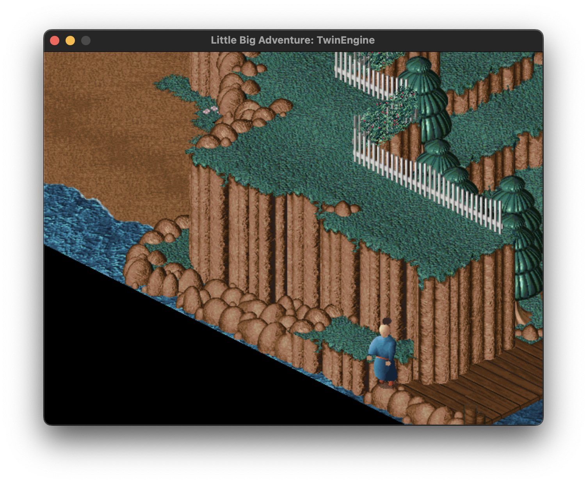
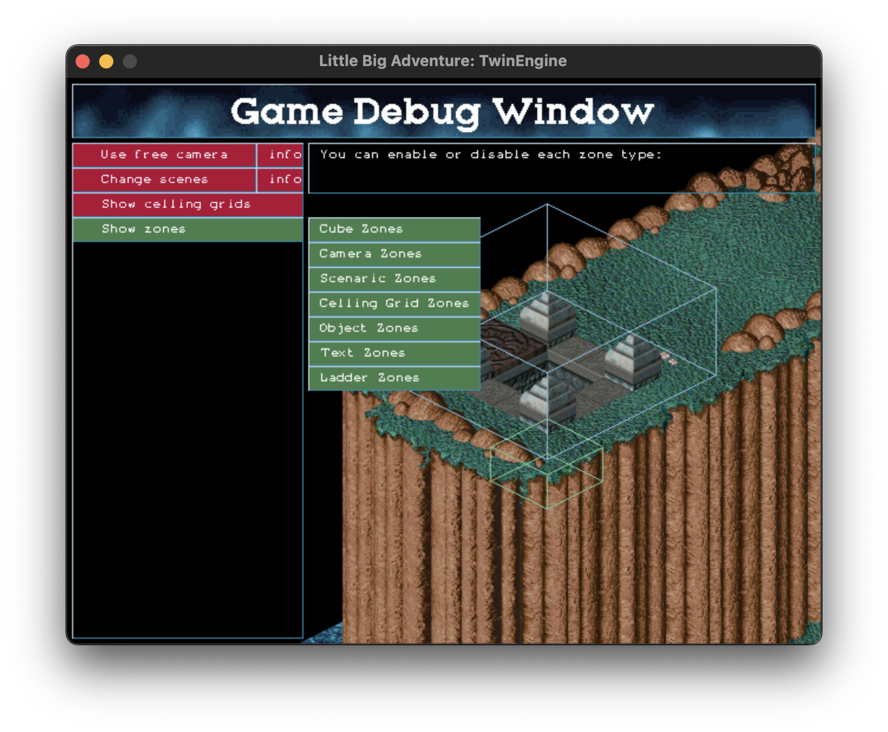
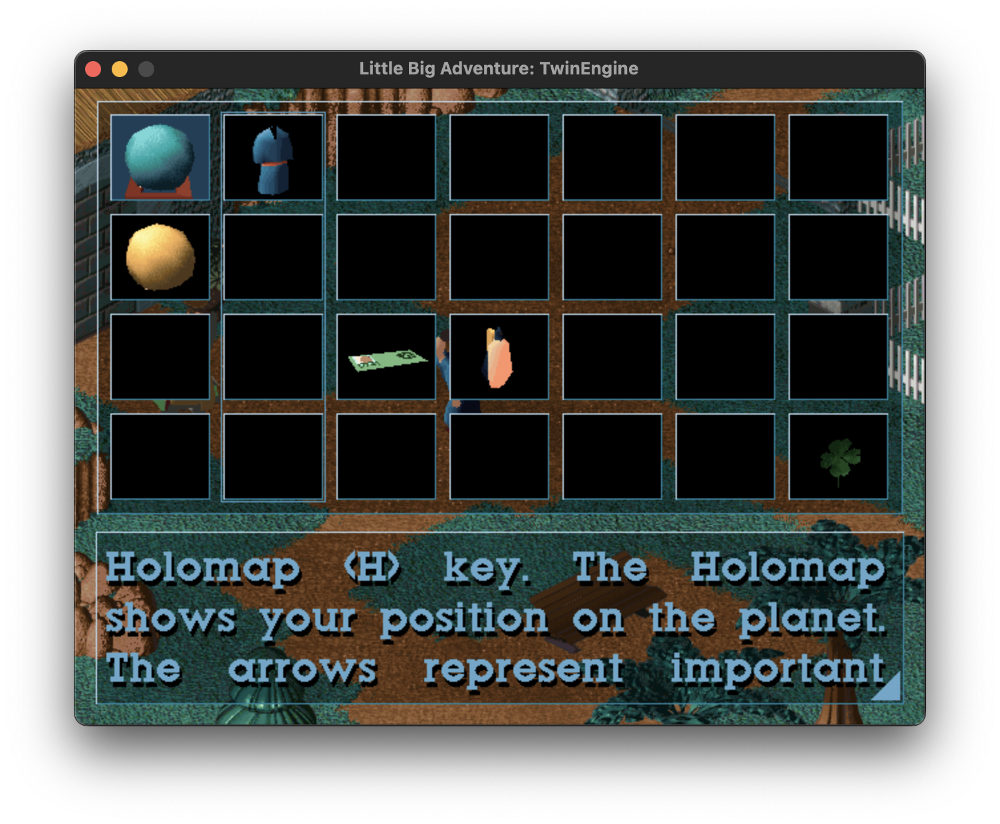

# TwinEngine: a Little Big Adventure engine #

Welcome to TwinEngine project.
This project allows you to play Little Big Adventure 1 (Relentless: Twinsen's Adventure) game.

Started in 2002, the project is a complete rewrite of the original game engine. With the original source code now available, we aim to finish the missing pieces and create a more portable and modern engine for the game.

There is a fork of this engine available as part of the ScummVM project and can be found here: https://github.com/scummvm/scummvm/blob/master/engines/twine

## Goals

The main goal of this project is to create a modern and portable engine for the game Little Big Adventure 1 and have a clean codebase for learning purposes. We believe that the original architecture of the game is a good base for learning game development and we want to make it available for everyone.

## Status

The game is at beta stage with most the game features implemented. The entire game is in compatible mode with few important features like Holomap and menu management missing.
Check the [TODO.md](TODO.md) for more comprehensive list of missing features.

# How to use it

You can download the public release and copy all package content to LBA1 root directory. Some files must be overriden to properly run the application engine (e.g. lba.cfg).

The game requires the file midi_mi_win.hqr which is not bundled with the public release. You can find this converted file as part of the LbaWin project.

# Compiling

You need SDL, SDL_Mixer and SDL_ttf in order to compile twin-e.
We are still targetting the legacy SDL 1.2, but we should update to SDL3 at some stage.

## Mac OS X:

> brew install sdl sdl_mixer sdl_ttf

Note: as these libraries are old, you may need to modify the Homebrew formula and install them manually.

> cd src

> make -f Makefile.MacOSX

> cp twin-e_v0.3.0 ../bin

> cd ../bin

> ./twin-e_v0.3.0

Additionally, you can run the script ./makeinstall.sh that creates a clean buld and copies the binary to the bin directory.

## Linux:

> sudo apt-get install libsdl1.2-dev libsdl-mixer1.2-dev libsdl-ttf2.0-dev

> cd src

> make

> cp twin-e_v0.3.0 ../bin

> cd ../bin

> ./twin-e_v0.3.0

# Authors

Refer [AUTHORS.md](AUTHORS.md) file for a full list of contributions on this project.

# Copyright

Copyright [2.21]. The intellectual property is currently owned by [2.21].

Originaly developed by Adeline Software International in 1994.

# License

Copyright (C) 2002 The TwinEngine team

This program is free software; you can redistribute it and/or
modify it under the terms of the GNU General Public License 
as published by the Free Software Foundation; either version 2
of the License, or (at your option) any later version.

This program is distributed in the hope that it will be useful,
but WITHOUT ANY WARRANTY; without even the implied warranty of
MERCHANTABILITY or FITNESS FOR A PARTICULAR PURPOSE.  See the
GNU General Public License for more details.

You should have received a copy of the GNU General Public License
along with this program; if not, write to the Free Software
Foundation, Inc., 59 Temple Place - Suite 330, Boston, MA  02111-1307, USA.

Refer [COPYING.md](COPYING.md) file for full license descriptions.
